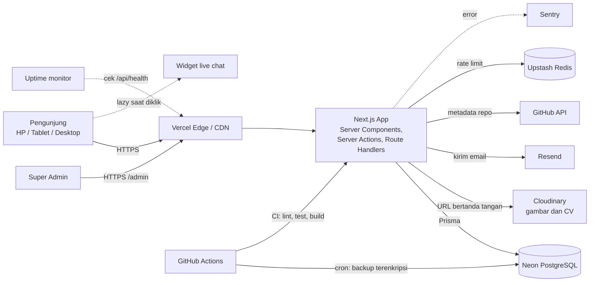
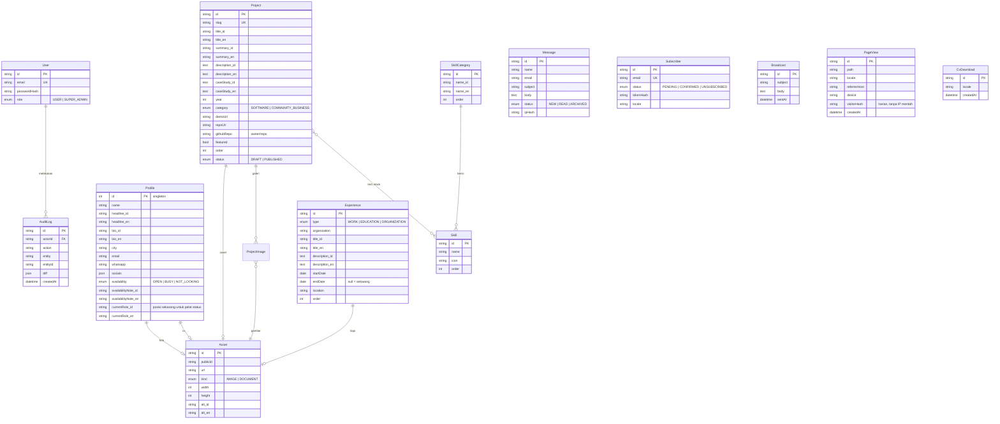

# ARCHITECTURE — Portofolio Muhammad Mirza

Status: **draf v1**. Bagian ini adalah acuan teknis. Perubahan besar dicatat di bagian 12 (Catatan Keputusan).

## 1. Prinsip

1. **Satu aplikasi, satu bahasa.** Next.js full-stack TypeScript. Tidak ada server terpisah (Opsi A).
2. **Konten di database, bukan di kode.** Admin mengubah konten, situs memperbarui halaman lewat revalidate.
3. **Gratis dulu, bisa dipindah.** Semua layanan punya tier gratis dan tidak mengunci arsitektur.
4. **Aman dan privat secara bawaan.** Tanpa cookie pelacak, IP di-hash, semua input divalidasi.
5. **Sederhana.** Tidak menambah layanan atau library tanpa alasan yang tercatat.

## 2. Tech Stack

Versi memakai rilis stabil terbaru saat setup (Milestone 1) dan dikunci di `package.json`/lockfile.

| Lapisan | Pilihan | Alasan | Alternatif yang tidak dipilih |
|---|---|---|---|
| Runtime / paket | **Node.js 24 LTS**, **pnpm 10** | Node 24 = Active LTS (didukung sampai April 2028). pnpm: cepat, hemat disk, lockfile deterministik, didukung Vercel | npm, yarn, Bun (kompatibilitas dengan Next.js/Prisma belum setara Node) |
| Framework | **Next.js 16 (App Router, Turbopack)** + React 19 + **TypeScript strict** | SEO (SSG/ISR), satu codebase untuk UI dan API, cocok dengan Vercel | Astro (kurang cocok untuk admin dinamis), Remix |
| Styling | **Tailwind CSS** + design token CSS variables | Cepat, konsisten, mudah tema gelap/terang | CSS Modules |
| Komponen | **shadcn/ui** (Radix) | Aksesibel bawaan, kode dimiliki sendiri, mudah disesuaikan | MUI, Chakra |
| Animasi | **Motion** (Framer Motion) + canvas ringan untuk hero | Deklaratif, mendukung reduced-motion | GSAP, Three.js (terlalu berat untuk HP) |
| Tema | **next-themes** | Tanpa flicker, ikut sistem | Buatan sendiri |
| i18n | **next-intl**, rute `/id` dan `/en` | Server component friendly, SEO (`hreflang`) | i18next |
| Database | **PostgreSQL di Neon** | Serverless, tier gratis, branching database | Supabase (fitur lebih banyak dari yang dibutuhkan) |
| ORM | **Prisma 7** (generator `prisma-client`, driver adapter `@prisma/adapter-pg`, `prisma.config.ts`) | Type-safe, migrasi jelas, sesuai pilihan Anda | Drizzle |
| Auth | **Auth.js (NextAuth v5)**, Credentials, sesi JWT | Sesuai pilihan Anda, cukup untuk satu admin | Better Auth (cadangan jika Auth.js v5 bermasalah) |
| Hash password | **Argon2id** (`@node-rs/argon2`) | Standar modern, jalan di Vercel | bcrypt |
| Validasi | **Zod** + React Hook Form | Satu skema untuk client dan server | Yup |
| Markdown | `react-markdown` + `rehype-sanitize` | Studi kasus project ditulis di admin, aman dari XSS | MDX di repo |
| Upload | **Cloudinary** (unggah bertanda tangan) | Optimasi gambar otomatis, PDF didukung, tier gratis, tanpa kartu kredit | Cloudflare R2, Vercel Blob |
| Email | **Resend** | API sederhana, tier gratis, cocok untuk kontak dan newsletter | SMTP sendiri |
| Rate limit | **Upstash Redis** (`@upstash/ratelimit`) | Cocok serverless, tier gratis | Tabel database |
| GitHub | **Octokit** (REST, token read-only, di-cache) | Metadata repo tanpa membebani limit | Scraping |
| Analitik | Pencatatan sendiri (tabel `PageView`, tanpa cookie) + **Vercel Web Analytics** + **Speed Insights** | Statistik untuk dashboard admin tanpa banner cookie | Google Analytics (cookie, banner persetujuan) |
| Live chat | Widget pihak ketiga gratis (default **Tawk.to**), lazy saat diklik | Memenuhi permintaan fitur tanpa server WebSocket | Server WebSocket sendiri (tidak didukung Vercel) |
| Error tracking | **Sentry** | Tier gratis, integrasi Next.js | LogRocket |
| Uptime | **Better Stack** atau UptimeRobot (gratis) | Notifikasi email dan Telegram | — |
| Unit test | **Vitest** + Testing Library | Cepat, cocok TypeScript | Jest |
| E2E dan a11y | **Playwright** + `@axe-core/playwright` | Uji lintas browser dan aksesibilitas otomatis | Cypress |
| Performa | **Lighthouse CI** | Gerbang skor ≥ 90 di CI | Manual |
| Bahasa | **TypeScript 6.0** (strict) | Versi jembatan menuju TypeScript 7. TS 7 belum dipakai karena `typescript-eslint` baru mendukung < 6.1 | TypeScript 5.9 |
| Lint/format | **ESLint 10** + Prettier + `tsc --noEmit` | Standar ekosistem Next. ESLint 9 sudah tidak didukung. Plugin bawaan `eslint-config-next` (react, jsx-a11y, import) belum mendukung ESLint 10, jadi dibungkus `fixupConfigRules` dari `@eslint/compat` | Biome |
| Git hooks | Husky + lint-staged | Cegah commit yang rusak | — |
| Scan secret | **gitleaks** di CI | Cegah kebocoran kunci | — |
| CI/CD | **GitHub Actions** + integrasi Git **Vercel** | Preview per PR, deploy otomatis dari `main` | — |
| Hosting | **Vercel** | Terintegrasi Next.js, rollback satu klik | VPS + Docker (lebih banyak kerja) |
| Domain | `.site` (dibimbing saat deploy) | Pilihan Anda | — |

## 3. Diagram Sistem



### Strategi render

| Halaman | Render | Cache |
|---|---|---|
| Home, About, Experience, Skills, Projects, detail Project | Static + ISR, dibatalkan lewat `revalidateTag` saat admin menyimpan | Tag per entitas |
| Kontak, Privasi, 404 | Static | — |
| `/admin/*` | Dinamis, tanpa cache, `noindex` | — |
| Metadata GitHub | Fetch server dengan `revalidate` 1 jam | Data cache Next |

## 4. Struktur Folder

```
.
├── README.md, CLAUDE.md      # di akar hanya berkas .md (plus folder .github/ dan .agents/)
├── Frontend/                 # aplikasi Next.js (UI publik, panel admin, route handler sementara)
│   ├── src/
│   │   ├── app/
│   │   │   ├── [locale]/     # halaman publik (id, en)
│   │   │   ├── admin/        # panel Super Admin (tanpa locale, M2)
│   │   │   ├── api/          # route handlers (health, dan lainnya)
│   │   │   └── global-not-found.tsx
│   │   ├── components/       # ui/ (gaya shadcn), sections/, admin/, shared/
│   │   ├── features/         # per domain: projects/, skills/, experience/, ...
│   │   ├── lib/              # db, auth, env, github, cloudinary, resend, ratelimit
│   │   ├── i18n/             # konfigurasi next-intl
│   │   ├── fonts/            # font self-host (OFL)
│   │   └── generated/prisma/ # client Prisma hasil generate (tidak di-commit)
│   ├── messages/             # id.json, en.json (teks UI)
│   ├── scripts/seed.ts       # menjalankan data seed ke database
│   ├── tests/unit/           # Vitest
│   ├── e2e/                  # Playwright + axe
│   ├── prisma.config.ts      # menunjuk ke ../Database/
│   └── package.json          # semua perintah pnpm dijalankan dari sini
├── Backend/                  # README peta kode server (backend berjalan di dalam Next.js)
├── Database/
│   ├── schema.prisma         # skema database
│   ├── migrations/           # migrasi SQL
│   └── seed/seed-data.ts     # data awal dari CV
├── Documentation/            # PRD, DESIGN, ARCHITECTURE, WORKFLOW, TODO, CONTENT, REFERENCES
├── .github/                  # workflows, dependabot, templat PR
└── .agents/skill/           # skill proyek untuk Claude Code
```

Aturan: satu domain, satu folder di `features/`. Kode `lib/` tidak boleh mengimpor dari `features/`.

### Catatan implementasi (M1)

- **Next 16:** `middleware.ts` diganti `Frontend/src/proxy.ts` (runtime Node.js), `params` selalu async, `revalidateTag(tag, profile)` butuh argumen kedua, dan `updateTag` dipakai di Server Action. Dokumentasi yang sesuai versi ada di `node_modules/next/dist/docs/` (lihat `AGENTS.md`).
- **Root layout:** tidak ada `app/layout.tsx`. `app/[locale]/layout.tsx` adalah root layout situs publik (`dynamicParams = false`, hanya `id`/`en`), dan nanti `app/admin/layout.tsx` menjadi root layout kedua. URL yang tidak dikenal ditangani `app/global-not-found.tsx` (flag `experimental.globalNotFound`).
- **Font:** self-host lewat `next/font/local` dari berkas Fontsource di `Frontend/src/fonts/`, jadi build tidak mengakses Google Fonts.
- **Prisma client** di-generate ke `Frontend/src/generated/prisma` (tidak di-commit, dibuat oleh `postinstall`). Skema dan migrasi ada di `Database/`, sedangkan Prisma CLI dijalankan dari `Frontend/` lewat `Frontend/prisma.config.ts`. CLI dan seed membaca `Frontend/.env.local` lalu `.env`, sama seperti Next.js.
- **Vercel:** Root Directory = `Frontend`, dengan opsi "Include files outside the Root Directory" aktif (bawaan) agar `../Database/` ikut terbaca saat build.
- **Konfigurasi env** divalidasi saat pertama dipakai (`getServerEnv()`), bukan saat impor, supaya halaman statis bisa di-build tanpa database.

## 5. Model Data

Konten dua bahasa memakai kolom berpasangan `*_id` dan `*_en`. Semua kolom teks publik wajib punya kedua bahasa (divalidasi Zod).



Catatan:
- `User.role` menyimpan `USER` dan `SUPER_ADMIN` agar sesuai rencana, tetapi hanya satu `SUPER_ADMIN` yang dibuat lewat seed. Tidak ada registrasi publik.
- `PageView.visitorHash` = hash(IP + user-agent + garam harian). Garam berganti tiap hari sehingga pengunjung tidak bisa dilacak lintas hari.
- Tabel besar seperti `PageView` diringkas dan dibersihkan otomatis (retensi 13 bulan).

## 6. Rancangan API

### 6.1 Panel admin
Mutasi memakai **Server Actions**, bukan REST. Setiap action:
1. memeriksa sesi dan role `SUPER_ADMIN` di sisi server,
2. memvalidasi input dengan Zod,
3. menulis ke database dan `AuditLog` dalam satu transaksi,
4. memanggil `revalidateTag`.

### 6.2 Route Handlers

| Metode | Path | Akses | Fungsi |
|---|---|---|---|
| GET | `/api/v1/projects` | Publik | Daftar project terbit (`?locale=id\|en`, paginasi) |
| GET | `/api/v1/projects/{slug}` | Publik | Detail project |
| GET | `/api/v1/skills` | Publik | Skill per kategori |
| GET | `/api/v1/profile` | Publik | Profil publik |
| POST | `/api/contact` | Publik, rate limit | Kirim pesan kontak |
| POST | `/api/newsletter/subscribe` | Publik, rate limit | Daftar, kirim email konfirmasi |
| GET | `/api/newsletter/confirm?token=` | Publik | Konfirmasi langganan |
| GET | `/api/newsletter/unsubscribe?token=` | Publik | Berhenti langganan |
| POST | `/api/track` | Publik, rate limit | Catat kunjungan halaman (beacon) |
| GET | `/api/cv` | Publik | Catat unduhan lalu arahkan ke CV terbaru |
| POST | `/api/admin/upload-sign` | Admin | Tanda tangan unggahan Cloudinary |
| GET | `/api/admin/github/repo?name=` | Admin | Ambil data repo untuk impor project |
| GET | `/api/health` | Publik | Status untuk uptime monitor (tanpa data sensitif) |

### 6.3 Kontrak

- Respons JSON, `Content-Type: application/json`.
- Sukses: `{ "data": ..., "meta": { ... } }`. Galat: `{ "error": { "code": "VALIDATION_ERROR", "message": "...", "fields": { ... } } }`.
- Kode HTTP: 200/201, 400 (validasi), 401, 403, 404, 429 (rate limit), 500.
- API publik: read-only, `Cache-Control: public, s-maxage=300, stale-while-revalidate=3600`, CORS `GET` saja.
- Versi di path (`/v1`). Perubahan yang merusak berarti `/v2`.

Contoh:

```http
POST /api/contact
{ "name": "Rina", "email": "rina@contoh.id", "subject": "Kolaborasi", "message": "Halo Mirza ...", "website": "" }

201 { "data": { "id": "..." } }
400 { "error": { "code": "VALIDATION_ERROR", "message": "Data tidak valid", "fields": { "email": "Format email tidak valid" } } }
429 { "error": { "code": "RATE_LIMITED", "message": "Terlalu banyak percobaan, coba lagi nanti" } }
```

`website` adalah kolom honeypot. Jika terisi, pesan dibuang diam-diam dan tetap membalas sukses.

## 7. Autentikasi dan Otorisasi

- Auth.js Credentials, sesi **JWT**, cookie `httpOnly`, `secure`, `sameSite=lax`. Masa berlaku sesi pendek (misalnya 8 jam).
- Login dibatasi (misalnya 5 percobaan per 15 menit per IP dan per email) dan diberi jeda seragam agar tidak membocorkan apakah email ada.
- **Pertahanan berlapis:** middleware/proxy melindungi `/admin/*`, dan setiap Server Action serta route handler admin memeriksa ulang sesi dan role.
- Tidak ada registrasi publik. Akun admin dibuat lewat `prisma db seed` memakai `ADMIN_EMAIL` dan `ADMIN_PASSWORD` dari environment, lalu password diganti lewat admin.
- Lupa password: prosedur pemulihan lewat skrip yang dijalankan pemilik (`pnpm admin:reset-password`), tanpa alur email publik.

## 8. Rencana Keamanan

| Ancaman | Kontrol |
|---|---|
| XSS | React escape default. Markdown lewat `rehype-sanitize`. CSP ketat dengan nonce. Tidak ada `dangerouslySetInnerHTML` tanpa sanitasi |
| Injeksi SQL | Hanya lewat Prisma (parameterisasi). Tidak ada `$queryRawUnsafe` |
| CSRF | Server Actions memeriksa Origin. Route handler mutasi memeriksa `Origin`/`Sec-Fetch-Site` |
| Brute force | Rate limit login dan form publik (Upstash) |
| Spam form | Honeypot + rate limit + validasi panjang. CAPTCHA hanya jika masih ada spam |
| Upload berbahaya | Unggah bertanda tangan langsung ke Cloudinary. Batasi tipe (gambar, PDF) dan ukuran |
| Kebocoran secret | Hanya `Frontend/.env.example` di repo. Secret di Vercel. `gitleaks` di CI dan pre-commit |
| Header | HSTS, `X-Content-Type-Options`, `Referrer-Policy`, `Permissions-Policy`, `frame-ancestors 'none'` |
| Privasi data | IP di-hash. Log tidak memuat isi pesan atau email. Retensi data dibatasi |
| Rantai pasok | Dependabot, `pnpm audit` di CI, versi terkunci |
| Akses admin | Satu akun, log audit, notifikasi login baru via email |

Kunci yang dibutuhkan (semua lewat environment, divalidasi Zod saat start): `DATABASE_URL`, `DIRECT_URL`, `AUTH_SECRET`, `AUTH_URL`, `ADMIN_EMAIL`, `ADMIN_PASSWORD` (hanya untuk seed), `CLOUDINARY_*`, `RESEND_API_KEY`, `CONTACT_TO_EMAIL`, `UPSTASH_REDIS_REST_*`, `GITHUB_TOKEN`, `SENTRY_DSN`, `HASH_SALT_SECRET`.

## 9. Lingkungan dan Deployment

| Lingkungan | Tujuan | Database |
|---|---|---|
| Lokal | Pengembangan | Neon branch `dev` atau Postgres lokal |
| Preview (per PR) | Review hasil sebelum merge | Neon branch `preview` |
| Production | Situs live | Neon branch `main` |

Alur: PR → CI hijau → Vercel membuat preview → merge ke `main` → Vercel deploy production. Migrasi database dijalankan `prisma migrate deploy` pada tahap build production, hanya untuk migrasi yang kompatibel ke belakang (tambah kolom dulu, hapus kolom di rilis berikutnya).

**Rollback:** Vercel "Instant Rollback" ke deployment sebelumnya. Jika migrasi ikut berubah, pulihkan dari backup (bagian 11).

## 10. CI/CD (GitHub Actions)

| Workflow | Pemicu | Isi |
|---|---|---|
| `ci.yml` | PR dan push ke `main` | install, `lint`, `format:check`, `typecheck`, `test` (Vitest), migrasi + cek drift skema, seed 2× (idempoten), `build`, Playwright + axe (Chromium, emulasi HP), `gitleaks` |
| `e2e.yml` | PR | Playwright (Chromium + WebKit + Firefox) dan axe pada URL preview |
| `lighthouse.yml` | PR | Lighthouse CI, gagal jika kategori < 90 |
| `backup.yml` | Cron harian | `pg_dump`, kompres, **enkripsi**, simpan sebagai artifact/penyimpanan privat |
| `dependabot.yml` | Mingguan | Update dependency dan GitHub Actions |

Artifact di repo publik dapat diunduh siapa saja, karena itu dump backup **wajib dienkripsi** sebelum diunggah.

## 11. Monitoring, Logging, dan Backup

- **Sentry:** error server dan client, tanpa data pribadi.
- **Uptime monitor:** memeriksa `/api/health` (cek koneksi database). Notifikasi ke email dan Telegram.
- **Vercel Analytics + Speed Insights:** tren traffic dan performa.
- **Backup:** dump harian terenkripsi (retensi 30 hari) di luar Neon, ditambah fitur pemulihan bawaan Neon. Uji pemulihan minimal satu kali sebelum rilis dan tiap triwulan.
- **Log audit:** di database, hanya bisa dibaca admin.

## 12. Catatan Keputusan (ADR ringkas)

| # | Keputusan | Alasan | Status |
|---|---|---|---|
| 1 | Next.js full-stack tanpa backend terpisah | Cepat selesai, satu deploy | Final (jawaban 17.2), **dikonfirmasi ulang 2026-09-30** |
| 1a | Tidak memakai ASP.NET Core + Next.js (stack GAAS) atau FastAPI | Dipertimbangkan 2026-09-30. Ditolak karena: (1) recruiter menilai project, bukan arsitektur situs portofolio, dan kemampuan C#/.NET sudah terbukti lewat project GAAS; (2) backend .NET di hosting gratis "tidur" 30–50 detik saat sepi; (3) dua deploy dan dua layanan untuk satu orang; (4) M1 sudah jadi dan teruji. Bisa ditinjau lagi bila target kerja spesifik .NET | Final |
| 2 | Konten di DB dengan kolom `_id`/`_en` | Sederhana, mudah dicari dan divalidasi, cukup untuk dua bahasa | Diusulkan |
| 3 | Analitik sendiri tanpa cookie | Tidak perlu banner cookie, data untuk dashboard admin | Diusulkan |
| 4 | Live chat lewat widget lazy | Vercel tidak menjalankan WebSocket permanen | Menunggu konfirmasi |
| 5 | Rate limit + honeypot di form publik | Mencegah spam dan kuota email habis | Menunggu konfirmasi (berbeda dari jawaban awal) |
| 6 | Auth.js dengan Better Auth sebagai cadangan | Auth.js v5 masih relatif baru | Diusulkan |
