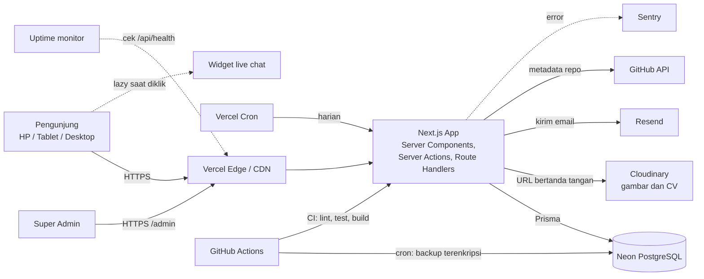

# ARCHITECTURE — Portofolio Muhammad Mirza

Status: **draf v1**. Bagian ini adalah acuan teknis. Perubahan besar dicatat di bagian 12 (Catatan Keputusan).

## 1. Prinsip

1. **Satu aplikasi, satu bahasa.** Next.js full-stack TypeScript. Tidak ada server terpisah (Opsi A).
2. **Konten di database, bukan di kode.** Admin mengubah konten, situs memperbarui halaman lewat revalidate.
3. **Gratis dulu, bisa dipindah.** Semua layanan punya tier gratis dan tidak mengunci arsitektur.
4. **Aman dan privat secara bawaan.** Tanpa cookie pelacak, IP di-hash, semua input divalidasi.
5. **Sederhana.** Tidak menambah layanan atau library tanpa alasan yang tercatat.

## 2. Tech Stack

Versi memakai rilis stabil terbaru saat setup (Milestone 1) dan dikunci di `package.json`/lockfile.

| Lapisan | Pilihan | Alasan | Alternatif yang tidak dipilih |
|---|---|---|---|
| Runtime / paket | **Node.js 24 LTS**, **pnpm 10** | Node 24 = Active LTS (didukung sampai April 2028). pnpm: cepat, hemat disk, lockfile deterministik, didukung Vercel | npm, yarn, Bun (kompatibilitas dengan Next.js/Prisma belum setara Node) |
| Framework | **Next.js 16 (App Router, Turbopack)** + React 19 + **TypeScript strict** | SEO (SSG/ISR), satu codebase untuk UI dan API, cocok dengan Vercel | Astro (kurang cocok untuk admin dinamis), Remix |
| Styling | **Tailwind CSS** + design token CSS variables | Cepat, konsisten, mudah tema gelap/terang | CSS Modules |
| Komponen | **shadcn/ui** (Radix) | Aksesibel bawaan, kode dimiliki sendiri, mudah disesuaikan | MUI, Chakra |
| Animasi | **CSS bawaan** (scroll-driven animation, View Transitions, `@starting-style`) untuk reveal, transisi, dan hover. **Canvas 2D buatan sendiri** untuk hero. **Motion** hanya untuk animasi yang bergantung state React (menu, modal, daftar), dimuat di komponen yang butuh saja | 0 KB JS untuk sebagian besar gerak, ringan di HP, mendukung Lighthouse ≥ 90 dan `prefers-reduced-motion` | Motion untuk semua animasi (JS lebih berat), GSAP (baru dipertimbangkan bila butuh animasi scroll yang sangat kompleks), Three.js/WebGL (terlalu berat untuk HP), Lenis (mengganggu scroll bawaan dan aksesibilitas) |
| Tema | **next-themes** | Tanpa flicker, ikut sistem | Buatan sendiri |
| i18n | **next-intl**, rute `/id` dan `/en` | Server component friendly, SEO (`hreflang`) | i18next |
| Database | **PostgreSQL 17 di Neon**, dipasang lewat **integrasi Vercel Marketplace** | Serverless, tier gratis permanen, branch database per preview, env terisi otomatis. Fitur yang dipakai: `timestamptz`, `uuid`, `jsonb`, transactional DDL | MySQL (PlanetScale tidak lagi gratis, tanpa `timestamptz`/`uuid` bawaan, DDL tidak transaksional), Supabase (tidur setelah seminggu sepi), Prisma Postgres |
| ORM | **Prisma 7** (generator `prisma-client`, driver adapter `@prisma/adapter-pg`, `prisma.config.ts`) | Type-safe, migrasi jelas, sesuai pilihan Anda | Drizzle |
| Auth | **Better Auth**: email + password, pendaftaran publik dimatikan, adapter Prisma, sesi disimpan di database | Stabil, TypeScript penuh, sesi bisa dicabut, rate limit login bawaan. Auth.js v5 lama berstatus beta dan pengembangannya bergabung dengan tim Better Auth | Auth.js v5, JWT buatan sendiri (pola GAAS) |
| Hash password | **Bawaan Better Auth** (scrypt) | Aman, tanpa dependency tambahan, konsisten dengan cara Better Auth memverifikasi login | Argon2id, bcrypt |
| Validasi | **Zod** | Satu skema untuk server dan form | Yup |
| Form publik (kontak, newsletter) | **Server Actions + `useActionState` (React 19) + Zod**, tanpa library form | JS lebih sedikit untuk pengunjung, tetap berfungsi sebelum JS selesai dimuat, pemeriksaan Origin bawaan Server Actions | React Hook Form |
| Form admin (project, galeri, profil) | **React Hook Form** + Zod, dikirim ke Server Actions | Nyaman untuk form panjang dua bahasa dan field dinamis | Formik, TanStack Form |
| Tabel admin | **TanStack Table** (M2) | Headless, cari/urut/paginasi, cocok dengan shadcn | AG Grid (berat) |
| Grafik dashboard admin | **Recharts** lewat shadcn charts (M2), hanya dimuat di `/admin` | Standar shadcn, tidak membebani halaman publik | Chart.js |
| Markdown | Editor: **textarea Markdown + pratinjau** di admin. Tampilan: `react-markdown` + `rehype-sanitize` | Studi kasus project ditulis di admin, ringan, aman dari XSS | Editor WYSIWYG (berat, HTML sulit disanitasi), MDX di repo |
| Upload | **Cloudinary** (unggah bertanda tangan) | Optimasi gambar otomatis, PDF didukung, tier gratis, tanpa kartu kredit | Cloudflare R2, Vercel Blob |
| Email | **Resend** + **React Email** untuk template | API sederhana, tier gratis. Template email ditulis sebagai komponen React dua bahasa | SMTP sendiri, template HTML manual |
| Rate limit | Login: **rate limit bawaan Better Auth** (penyimpanan database). Form publik dan `/api/track`: **tabel `RateLimit` di PostgreSQL** + helper `lib/rate-limit.ts` | Trafik portofolio kecil, jadi Postgres cukup. Satu layanan dan akun lebih sedikit | Upstash Redis (bisa ditambah bila trafik besar) |
| GitHub | **`fetch` biasa** ke GitHub REST API (token read-only), di-cache Next.js 1 jam | Hanya 1–2 endpoint, tidak perlu library | Octokit, scraping |
| Tugas terjadwal | **Vercel Cron** (`Frontend/vercel.json`) memanggil `/api/cron/*` yang dilindungi `CRON_SECRET`. Paket gratis: maksimal sekali sehari per job | Bersihkan data lama (retensi `PageView`, `RateLimit`), ganti garam hash harian, ringkas statistik | GitHub Actions cron (tetap dipakai untuk backup) |
| Analitik | Pencatatan sendiri (tabel `PageView`, tanpa cookie) + **Vercel Web Analytics** + **Speed Insights** | Statistik untuk dashboard admin tanpa banner cookie | Google Analytics (cookie, banner persetujuan) |
| Live chat | Widget pihak ketiga gratis (default **Tawk.to**), lazy saat diklik | Memenuhi permintaan fitur tanpa server WebSocket | Server WebSocket sendiri (tidak didukung Vercel) |
| Error tracking | **Sentry** | Tier gratis, integrasi Next.js | LogRocket |
| Uptime | **Better Stack** atau UptimeRobot (gratis) | Notifikasi email dan Telegram | — |
| Unit test | **Vitest** + Testing Library | Cepat, cocok TypeScript | Jest |
| E2E dan a11y | **Playwright** + `@axe-core/playwright` | Uji lintas browser dan aksesibilitas otomatis | Cypress |
| Performa | **Lighthouse CI** | Gerbang skor ≥ 90 di CI | Manual |
| Bahasa | **TypeScript 6.0** (strict) | Versi jembatan menuju TypeScript 7. TS 7 belum dipakai karena `typescript-eslint` baru mendukung < 6.1 | TypeScript 5.9 |
| Lint/format | **ESLint 10** + Prettier + `tsc --noEmit` | Standar ekosistem Next. ESLint 9 sudah tidak didukung. Plugin bawaan `eslint-config-next` (react, jsx-a11y, import) belum mendukung ESLint 10, jadi dibungkus `fixupConfigRules` dari `@eslint/compat` | Biome |
| Git hooks | Husky + lint-staged | Cegah commit yang rusak | — |
| Scan secret | **gitleaks** di CI | Cegah kebocoran kunci | — |
| CI/CD | **GitHub Actions** + integrasi Git **Vercel** | Preview per PR, deploy otomatis dari `main` | — |
| Hosting | **Vercel** | Terintegrasi Next.js, rollback satu klik | VPS + Docker (lebih banyak kerja) |
| Domain | `.site` (dibimbing saat deploy) | Pilihan Anda | — |

## 3. Diagram Sistem



### Strategi render

| Halaman | Render | Cache |
|---|---|---|
| Home, About, Experience, Skills, Projects, detail Project | Static (SSG) + ISR. Data lewat `unstable_cache` bertag (`features/*/public.ts`); aksi admin memanggil `updateTag` + `revalidatePath` literal `/id` dan `/en` sehingga perubahan langsung tampil | Tag per entitas (`lib/cache-tags.ts`) |
| Detail project yang terbit setelah build | Dirender saat pertama diminta (`dynamicParams = true` di `[slug]`) lalu di-cache | Tag `projects` |
| Kontak, Privasi, 404 | Static | — |
| Konfirmasi/berhenti newsletter | Dinamis (membaca `?token=`), `noindex` | — |
| `/admin/*` | Dinamis, tanpa cache, `noindex` | — |
| Metadata GitHub | Fetch server dengan `revalidate` 1 jam, gagal = tidak ditampilkan | Data cache Next |

Catatan:
- Cache data publik punya batas umur 10 menit (`PUBLIC_CACHE_SECONDS`) sebagai jaring pengaman: tanpa itu, data yang diubah di luar admin (misalnya `pnpm db:seed` setelah deploy pertama) tidak pernah tampil karena cache data bertahan antar-build. Aksi admin tetap langsung terlihat lewat `updateTag`.
- Data dari `unstable_cache` diserialisasi JSON, jadi query publik hanya mengembalikan nilai sederhana (tanggal sebagai string `YYYY-MM` atau ISO).
- Build butuh database (`DATABASE_URL`) karena halaman publik dirender dari data. CI dan Vercel sudah menyediakannya.
- **Jangan** `export const dynamicParams = false` di `app/[locale]/layout.tsx`: render ulang ISR setelah revalidasi gagal (`NoFallbackError`) dan semua halaman publik menjadi 404. Locale asing ditolak lewat `hasLocale()`.
- Filter tidak membuat halaman dinamis: filter pengalaman memakai radio + CSS `:has()` (tanpa JS), filter project di klien dan baru muncul bila ≥ 3 project atau ≥ 2 kategori.
- Gambar publik hanya dari akun Cloudinary di `CLOUDINARY_CLOUD_NAME` (`lib/public-image.ts`); gambar lain dilewati agar halaman tidak gagal render.

## 4. Struktur Folder

```
.
├── README.md, CLAUDE.md      # di akar hanya berkas .md (plus folder .github/ dan .agents/)
├── Frontend/                 # aplikasi Next.js (UI publik, panel admin, route handler sementara)
│   ├── src/
│   │   ├── app/
│   │   │   ├── [locale]/     # halaman publik (id, en)
│   │   │   ├── admin/        # panel Super Admin (tanpa locale, M2)
│   │   │   ├── api/          # route handlers (health, dan lainnya)
│   │   │   └── global-not-found.tsx
│   │   ├── components/       # ui/ (gaya shadcn), sections/, admin/, shared/
│   │   ├── features/         # per domain: projects/, skills/, experience/, ...
│   │   ├── lib/              # db, auth (Better Auth), env, github, cloudinary, email, rate-limit
│   │   ├── i18n/             # konfigurasi next-intl
│   │   ├── fonts/            # font self-host (OFL)
│   │   └── generated/prisma/ # client Prisma hasil generate (tidak di-commit)
│   ├── messages/             # id.json, en.json (teks UI)
│   ├── scripts/seed.ts       # menjalankan data seed ke database
│   ├── tests/unit/           # Vitest
│   ├── e2e/                  # Playwright + axe
│   ├── prisma.config.ts      # menunjuk ke ../Database/
│   └── package.json          # semua perintah pnpm dijalankan dari sini
├── Backend/                  # README peta kode server (backend berjalan di dalam Next.js)
├── Database/
│   ├── schema.prisma         # skema database
│   ├── migrations/           # migrasi SQL
│   └── seed/seed-data.ts     # data awal dari CV
├── Documentation/            # PRD, DESIGN, ARCHITECTURE, WORKFLOW, TODO, CONTENT, REFERENCES
├── .github/                  # workflows CI
└── .agents/skill/           # skill proyek untuk Claude Code
```

Aturan: satu domain, satu folder di `features/`. Kode `lib/` tidak boleh mengimpor dari `features/`.

### Catatan implementasi (M1)

- **Next 16:** `middleware.ts` diganti `Frontend/src/proxy.ts` (runtime Node.js), `params` selalu async, `revalidateTag(tag, profile)` butuh argumen kedua, dan `updateTag` dipakai di Server Action. Dokumentasi yang sesuai versi ada di `node_modules/next/dist/docs/` (lihat `AGENTS.md`).
- **Root layout:** tidak ada `app/layout.tsx`. `app/[locale]/layout.tsx` adalah root layout situs publik (hanya `id`/`en` lewat `generateStaticParams` + `hasLocale`), dan `app/admin/layout.tsx` root layout kedua. URL yang tidak dikenal ditangani `app/global-not-found.tsx` (flag `experimental.globalNotFound`).
- **Font:** self-host lewat `next/font/local` dari berkas Fontsource di `Frontend/src/fonts/`, jadi build tidak mengakses Google Fonts.
- **Prisma client** di-generate ke `Frontend/src/generated/prisma` (tidak di-commit, dibuat oleh `postinstall`). Skema dan migrasi ada di `Database/`, sedangkan Prisma CLI dijalankan dari `Frontend/` lewat `Frontend/prisma.config.ts`. CLI dan seed membaca `Frontend/.env.local` lalu `.env`, sama seperti Next.js.
- **Vercel:** Root Directory = `Frontend`, dengan opsi "Include files outside the Root Directory" aktif (bawaan) agar `../Database/` ikut terbaca saat build.
- **Konfigurasi env** divalidasi saat pertama dipakai (`getServerEnv()`), bukan saat impor, supaya halaman statis bisa di-build tanpa database.

## 5. Model Data

Konten dua bahasa memakai kolom berpasangan `*_id` dan `*_en`. Semua `id` bertipe UUID v7 (ditulis `string` di diagram). Semua kolom teks publik wajib punya kedua bahasa (divalidasi Zod).

```mermaid
erDiagram
    User ||--o{ AuditLog : "melakukan"
    Profile ||--o| Asset : "foto"
    Profile ||--o| Asset : "cv"
    Project ||--o| Asset : "cover"
    Project ||--o{ ProjectImage : "galeri"
    ProjectImage }o--|| Asset : "gambar"
    Project }o--o{ Skill : "tech stack"
    SkillCategory ||--o{ Skill : "berisi"
    Experience ||--o| Asset : "logo"

    User {
      string id PK
      string email UK
      string name
      boolean emailVerified
      enum role "USER | SUPER_ADMIN"
    }
    Session {
      string id PK
      string userId FK
      string token UK
      datetime expiresAt
    }
    Account {
      string id PK
      string userId FK
      string providerId "credential"
      string password "hash scrypt"
    }
    RateLimit {
      string key PK
      int count
      datetime windowStart
    }
    Profile {
      int id PK "singleton"
      string name
      string headline_id
      string headline_en
      string bio_id
      string bio_en
      string city
      string email
      string whatsapp
      json socials
      enum availability "OPEN | BUSY | NOT_LOOKING"
      string availabilityNote_id
      string availabilityNote_en
      string currentRole_id "posisi sekarang untuk pelat status"
      string currentRole_en
    }
    Project {
      string id PK
      string slug UK
      string title_id
      string title_en
      string summary_id
      string summary_en
      text description_id
      text description_en
      text caseStudy_id
      text caseStudy_en
      int year
      enum category "SOFTWARE | COMMUNITY_BUSINESS"
      string demoUrl
      string repoUrl
      string githubRepo "owner/repo"
      bool featured
      int order
      enum status "DRAFT | PUBLISHED"
    }
    SkillCategory {
      string id PK
      string name_id
      string name_en
      int order
    }
    Skill {
      string id PK
      string name
      string icon
      int order
    }
    Experience {
      string id PK
      enum type "WORK | EDUCATION | ORGANIZATION"
      string organization
      string title_id
      string title_en
      text description_id
      text description_en
      date startDate
      date endDate "null = sekarang"
      string location
      int order
    }
    Asset {
      string id PK
      string publicId
      string url
      enum kind "IMAGE | DOCUMENT"
      int width
      int height
      string alt_id
      string alt_en
    }
    Message {
      string id PK
      string name
      string email
      string subject
      text body
      enum status "NEW | READ | ARCHIVED"
      string ipHash
    }
    Subscriber {
      string id PK
      string email UK
      enum status "PENDING | CONFIRMED | UNSUBSCRIBED"
      string tokenHash
      string locale
    }
    Broadcast {
      string id PK
      string subject
      text body
      datetime sentAt
    }
    PageView {
      string id PK
      string path
      string locale
      string referrerHost
      string device
      string visitorHash "harian, tanpa IP mentah"
      datetime createdAt
    }
    PageViewDaily {
      uuid id PK
      date date
      string path
      string locale
      int views
      int visitors
    }
    AuditLog {
      string id PK
      string actorId FK
      string action
      string entity
      string entityId
      json diff
      datetime createdAt
    }
    CvDownload {
      string id PK
      string locale
      datetime createdAt
    }
```



Catatan:
- `User`, `Session`, `Account`, dan `Verification` mengikuti skema Better Auth (dibuat di M2 dengan `@better-auth/cli generate`, lalu disesuaikan). Hash password disimpan di `Account.password`, bukan di `User`. Kolom `passwordHash` di skema M1 dihapus lewat migrasi M2 (tabelnya masih kosong).
- `User.role` ditambahkan sebagai additional field Better Auth: `USER` atau `SUPER_ADMIN`. Hanya satu `SUPER_ADMIN` yang dibuat lewat seed. Tidak ada registrasi publik.
- `RateLimit` dipakai helper rate limit untuk form publik dan `/api/track`. Baris lama dibersihkan Vercel Cron.
- `PageView.visitorHash` = hash(IP + user-agent + garam harian). Garam berganti tiap hari sehingga pengunjung tidak bisa dilacak lintas hari.
- `PageView` mentah disimpan **90 hari**. Vercel Cron meringkasnya tiap hari ke `PageViewDaily` (disimpan permanen), lalu menghapus data mentah yang lewat 90 hari. Tujuannya menjaga kuota Neon gratis (0,5 GB).
- **Primary key UUID v7** (`@default(uuid(7)) @db.Uuid`): tipe asli PostgreSQL dan urut waktu. Seed memakai UUID v5 deterministik (`Frontend/scripts/seed-ids.ts`) agar idempoten.
- **Waktu:** semua `DateTime` bertipe `timestamptz(3)` dan disimpan UTC. Tampilan (halaman, email, PDF, export) selalu dikonversi ke `Asia/Jakarta`. Tanggal kalender tanpa jam (`startDate`, `endDate`, `PageViewDaily.date`) memakai `date`. Pelajaran dari audit GAAS F-01 (jam UTC tercetak sebagai WIB).

## 6. Rancangan API

### 6.1 Panel admin
Mutasi memakai **Server Actions**, bukan REST. Setiap action:
1. memeriksa sesi dan role `SUPER_ADMIN` di sisi server,
2. memvalidasi input dengan Zod,
3. menulis ke database dan `AuditLog` dalam satu transaksi,
4. memanggil `revalidateContent()` (`lib/revalidate.ts`): `updateTag` per domain lalu `revalidatePath` literal `/id` dan `/en`.

Pola diterapkan di `Frontend/src/features/<domain>/actions.ts` dan diuji di `tests/unit/authz.test.ts` (setiap action menolak tanpa sesi sebelum menyentuh database). Hasil action berbentuk `ActionResult` (`lib/action-result.ts`): pesan untuk toast dan `fieldErrors` untuk form. Catatan:

- **Jangan** `revalidatePath('/[locale]', 'layout')` dan jangan `dynamicParams = false` di layout locale: keduanya membuat halaman publik 404 setelah revalidasi (lihat Strategi render).
- Berkas `'use server'` hanya boleh mengekspor fungsi async. Konstanta dan skema ditaruh di `schema.ts`.
- Urutan project, kategori, dan skill diubah dengan tombol naik/turun (aksesibel untuk keyboard), urutan ditulis ulang 0..n dalam transaksi. Pengalaman diurutkan dari tanggal mulai.
- Log audit tidak memuat isi pesan, nama, atau email pengunjung. Email dan WhatsApp profil disamarkan.
- UI admin hanya berbahasa Indonesia (satu pengguna). Konten yang dikelola tetap dua bahasa.

| Modul | Halaman | Action |
|---|---|---|
| Profil | `/admin/profile` | `saveProfile` |
| Project | `/admin/projects`, `/new`, `/[id]` | `saveProject`, `deleteProject`, `moveProject`, `importFromGithub` |
| Skill | `/admin/skills` | `saveSkillCategory`, `deleteSkillCategory`, `moveSkillCategory`, `saveSkill`, `deleteSkill`, `moveSkill` |
| Pengalaman | `/admin/experience`, `/new`, `/[id]` | `saveExperience`, `deleteExperience` |
| Berkas | di Profil dan Project | `signAssetUpload`, `attachUploadedAsset`, `updateAssetAlt`, `removeAsset` |
| Pesan | `/admin/messages`, `/[id]` | `setMessageStatus`, `deleteMessage` |
| Pelanggan | `/admin/subscribers` | `deleteSubscriber` |
| Audit | `/admin/audit` | (baca saja) |
| Akun | `/admin/account` | `changePassword` |

**Unggah Cloudinary** (tanpa SDK): `signAssetUpload` membuat tanda tangan SHA-1 di server (secret tidak ke browser) → browser mengunggah langsung ke `api.cloudinary.com` → `attachUploadedAsset` memverifikasi tanda tangan respons (`public_id` + `version`), memeriksa ulang folder, tipe, format, ukuran, dan asal URL, lalu mencatat `Asset`. Berkas yang ditolak atau diganti dihapus dari Cloudinary. Tanpa kunci `CLOUDINARY_*`, form unggah diganti pesan "belum aktif". `next/image` hanya mengizinkan `res.cloudinary.com/<CLOUDINARY_CLOUD_NAME>/`.

### 6.2 Form publik (Server Actions)

Form kontak dan pendaftaran newsletter memakai **Server Action** dengan `useActionState`, bukan route handler, agar tetap berfungsi tanpa JavaScript di sisi klien (diuji E2E dengan JavaScript mati). Setiap action: validasi Zod, honeypot, rate limit per IP-hash, lalu mengembalikan state `{ status, fieldErrors, message, values }`. Pesan berupa kunci terjemahan, diterjemahkan di klien dan dibacakan lewat `role="alert"`/`status`.

| Action | Fungsi |
|---|---|
| `submitContact` | Honeypot → validasi → rate limit 5/jam per IP-hash → simpan `Message` (IP hanya hash) → notifikasi ke `CONTACT_TO_EMAIL` lewat Resend bila diatur (gagal kirim tidak menggagalkan pengunjung) |
| `subscribeNewsletter` | Double opt-in: `Subscriber` PENDING dengan hash token → email konfirmasi (React Email, dua bahasa) + header `List-Unsubscribe`. Jawaban sama untuk email yang sudah terdaftar (tidak bisa ditebak). Tanpa Resend: "belum aktif" |
| `confirmSubscription` | Dipanggil dari tombol di `/[locale]/newsletter/confirm?token=` (POST, bukan saat tautan dibuka, agar pemindai tautan email tidak ikut mengonfirmasi). Token hanya sekali pakai |
| `unsubscribe` | Dari `/[locale]/newsletter/unsubscribe?token=<id>.<hmac>`; token tanda tangan HMAC, tidak disimpan |

Email dikirim lewat REST API Resend dengan `fetch` (`lib/email.ts`, tanpa SDK). Template di `src/emails/` dirender `@react-email/render` (paket `@react-email/components` sudah deprecated, jadi tidak dipakai).

### 6.3 Route Handlers

| Metode | Path | Akses | Fungsi |
|---|---|---|---|
| GET | `/api/v1/projects` | Publik | Daftar project terbit. `?locale=id\|en` → teks satu bahasa, tanpa → `{ id, en }` |
| GET | `/api/v1/projects/{slug}` | Publik | Detail project terbit, 404 bila tidak ada |
| GET | `/api/v1/skills` | Publik | Skill per kategori beserta slug project yang memakainya |
| GET | `/api/v1/profile` | Publik | Profil publik **tanpa** email dan WhatsApp (agar tidak mudah dipanen bot) |
| POST | `/api/track` | Publik, same-origin, rate limit 300/jam | Beacon kunjungan tanpa cookie. `visitorHash` = HMAC(tanggal WIB + IP + user-agent), bot dilewati, path divalidasi |
| GET | `/api/cv` | Publik | Catat unduhan (tanpa data pribadi, bot dilewati) lalu arahkan ke CV terbaru; tanpa CV → `/[locale]/about` |
| GET | `/api/cron/daily` | Vercel Cron (`Authorization: Bearer CRON_SECRET`) | Ringkas 7 hari terakhir ke `PageViewDaily` (idempoten), hapus `PageView` > 90 hari dan `RateLimit` > 1 hari. Jadwal `0 18 * * *` UTC (01.00 WIB) di `vercel.json` |
| GET | `/api/health` | Publik | Status untuk uptime monitor (tanpa data sensitif) |

### 6.4 Kontrak

- Respons JSON, `Content-Type: application/json`.
- Sukses: `{ "data": ..., "meta": { ... } }`. Galat: `{ "error": { "code": "VALIDATION_ERROR", "message": "...", "fields": { ... } } }`.
- Kode HTTP: 200/201, 400 (validasi), 401, 403, 404, 429 (rate limit), 500.
- API publik: read-only, `Cache-Control: public, s-maxage=300, stale-while-revalidate=3600`, CORS `GET` saja.
- Versi di path (`/v1`). Perubahan yang merusak berarti `/v2`.

Contoh:

```http
GET /api/v1/projects?locale=id&page=1

200 { "data": [{ "slug": "gaas", "title": "GAAS", "summary": "...", "year": 2026 }], "meta": { "page": 1, "total": 1 } }
400 { "error": { "code": "VALIDATION_ERROR", "message": "Parameter tidak valid", "fields": { "locale": "Harus id atau en" } } }
429 { "error": { "code": "RATE_LIMITED", "message": "Terlalu banyak permintaan, coba lagi nanti" } }
```

Contoh state yang dikembalikan Server Action form kontak (bagian 6.2):

```ts
{ status: 'error', fieldErrors: { email: 'Format email tidak valid' }, message: 'Data tidak valid' }
{ status: 'success', message: 'Pesan terkirim' }
```

Kolom `website` pada form kontak adalah honeypot. Jika terisi, pesan dibuang diam-diam dan action tetap mengembalikan sukses.

## 7. Autentikasi dan Otorisasi

- **Better Auth** email + password dengan `disableSignUp: true`. Sesi disimpan di tabel `Session` (bisa dicabut dari admin), cookie `httpOnly`, `secure`, `sameSite=lax`. Masa berlaku sesi pendek (misalnya 8 jam).
- Login dibatasi oleh rate limit bawaan Better Auth (penyimpanan database, misalnya 5 percobaan per 15 menit per IP) dengan pesan galat yang sama untuk email salah maupun password salah.
- **Pertahanan berlapis:** middleware/proxy melindungi `/admin/*`, dan setiap Server Action serta route handler admin memeriksa ulang sesi dan role.
- Tidak ada registrasi publik. Akun admin dibuat oleh skrip seed (hash dari `better-auth/crypto` agar formatnya cocok) memakai `ADMIN_EMAIL` dan `ADMIN_PASSWORD` dari environment, lalu password diganti lewat `/admin/account` (5 percobaan per 15 menit, sesi di perangkat lain dicabut).
- Lupa password: prosedur pemulihan lewat skrip yang dijalankan pemilik (`pnpm admin:reset-password`), tanpa alur email publik.

## 8. Rencana Keamanan

| Ancaman | Kontrol |
|---|---|
| XSS | React escape default. Markdown lewat `rehype-sanitize`. CSP (`lib/csp.ts`): halaman publik statis tanpa nonce (`script-src 'self' 'unsafe-inline'`, arahan lain ketat), panel admin dinamis dengan nonce per permintaan + `'strict-dynamic'` (`src/proxy.ts`). Satu-satunya `dangerouslySetInnerHTML` adalah JSON-LD dengan `<` di-escape (`lib/json-ld.tsx`) |
| Injeksi SQL | Hanya lewat Prisma (parameterisasi). Tidak ada `$queryRawUnsafe` |
| CSRF | Server Actions memeriksa Origin. Route handler mutasi memeriksa `Origin`/`Sec-Fetch-Site` |
| Brute force | Rate limit login bawaan Better Auth dan tabel `RateLimit` untuk form publik |
| Spam form | Honeypot + rate limit + validasi panjang. CAPTCHA hanya jika masih ada spam |
| Upload berbahaya | Unggah bertanda tangan langsung ke Cloudinary. Respons diverifikasi di server, tipe (gambar, PDF) dan ukuran (5 MB) dicek ulang, berkas ditolak dihapus |
| Kebocoran secret | Hanya `Frontend/.env.example` di repo. Secret di Vercel. `gitleaks` di CI dan pre-commit |
| Header | HSTS, `X-Content-Type-Options`, `X-Frame-Options: DENY`, `Referrer-Policy`, `Permissions-Policy`, `Cross-Origin-Opener-Policy`, CSP dengan `frame-ancestors 'none'`, `object-src 'none'`, `form-action 'self'`. `upgrade-insecure-requests` hanya di Vercel |
| Privasi data | IP di-hash. Log tidak memuat isi pesan atau email. Retensi data dibatasi |
| Rantai pasok | `pnpm audit --audit-level=high` di CI, Dependabot alerts (notifikasi saja), update bulanan manual, `overrides` untuk celah dependency tidak langsung, versi terkunci |
| Akses admin | Satu akun, log audit, ganti password dengan rate limit. Notifikasi login baru via email menyusul bersama Resend (M4) |

Kunci yang dibutuhkan (semua lewat environment, divalidasi Zod saat start): `DATABASE_URL`, `DATABASE_URL_UNPOOLED` atau `DIRECT_URL` (migrasi), `BETTER_AUTH_SECRET`, `BETTER_AUTH_URL`, `ADMIN_EMAIL`, `ADMIN_PASSWORD` (hanya untuk seed), `CLOUDINARY_*`, `RESEND_API_KEY`, `EMAIL_FROM`, `CONTACT_TO_EMAIL`, `GITHUB_TOKEN`, `CRON_SECRET`, `SENTRY_DSN`, `HASH_SALT_SECRET`.

## 9. Lingkungan dan Deployment

| Lingkungan | Tujuan | Database |
|---|---|---|
| Lokal | Pengembangan | Postgres 17 lokal (Docker) atau Neon branch `dev` |
| Preview (per PR) | Review hasil sebelum merge | Neon branch per preview, dibuat dan dihapus otomatis oleh integrasi Vercel (maksimal 10 branch di paket gratis) |
| Production | Situs live | Neon branch `main` |

Alur kode: branch → PR → CI hijau → Vercel membuat preview → merge ke `main` → Vercel deploy production. Dokumen boleh langsung ke `main` (tidak memicu build).

**Konfigurasi hosting** (`Frontend/vercel.json`):

| Pengaturan | Nilai | Alasan |
|---|---|---|
| Region fungsi server | `sin1` (Singapura) | Vercel dan Neon belum punya region Indonesia. Singapura terdekat, dan satu kota dengan database. Halaman statis tetap dilayani CDN terdekat pengunjung |
| Build command | `pnpm build:vercel` → `scripts/vercel-build.sh` | `prisma migrate deploy` hanya bila `VERCEL_ENV=production` atau `MIGRATE_ON_BUILD=true` (preview dengan branch database sendiri) |
| Ignored Build Step | `scripts/vercel-ignore-build.sh` | Build dilewati bila tidak ada perubahan di `Frontend/` atau `Database/`. Bila commit pembanding tidak tersedia, build tetap dijalankan |

Migrasi harus kompatibel ke belakang (tambah kolom dulu, hapus kolom di rilis berikutnya), karena versi lama dan baru bisa sempat berjalan bersamaan.

**Batas paket gratis** yang relevan: Vercel Hobby (100 GB bandwidth, 1 juta pemanggilan fungsi per bulan, cron maksimal sekali sehari, **hanya untuk penggunaan pribadi non-komersial**) dan Neon Free (0,5 GB, 100 CU-jam, 10 branch, tidur setelah 5 menit). Bila situs kelak menawarkan jasa berbayar, pindah ke Vercel Pro atau Cloudflare Workers.

**Perlindungan `main`** (GitHub ruleset, diatur pemilik): status CI wajib hijau untuk merge PR, force push dan penghapusan branch diblokir, admin ada di bypass list untuk commit dokumen.

**Rollback:** Vercel "Instant Rollback" ke deployment sebelumnya. Jika migrasi ikut berubah, pulihkan dari backup (bagian 11).

**Deploy pertama tanpa langkah manual (2026-09-30):** `scripts/vercel-build.sh` di production menjalankan `prisma migrate deploy`, lalu `tsx scripts/seed.ts --bootstrap` (konten CV hanya bila belum ada profil; akun admin hanya bila belum ada Super Admin sama sekali), lalu `next build`. URL auth di Vercel tanpa `BETTER_AUTH_URL`: domain production proyek (`VERCEL_PROJECT_PRODUCTION_URL`), dan semua alamat Vercel deployment tersebut masuk `trustedOrigins`. Ignored Build Step selalu mem-build bila belum ada deploy sebelumnya.

## 10. CI/CD (GitHub Actions)

| Workflow | Pemicu | Isi |
|---|---|---|
| `ci.yml` | PR dan push ke `main` | install, `lint`, `format:check`, `typecheck`, `test` (Vitest), migrasi + cek drift skema, seed 2× (idempoten), `build`, Playwright + axe (Chromium, emulasi HP), `gitleaks` |
| `e2e.yml` | PR | Playwright (Chromium + WebKit + Firefox) dan axe pada URL preview |
| `lighthouse.yml` | PR | Lighthouse CI, gagal jika kategori < 90 |
| `backup.yml` | Cron harian | `pg_dump`, kompres, **enkripsi**, simpan sebagai artifact/penyimpanan privat |
| (tanpa bot) | Bulanan, manual | Update dependency dan GitHub Actions oleh Claude, commit atas nama pemilik (`WORKFLOW.md` bagian 10a) |

Artifact di repo publik dapat diunduh siapa saja, karena itu dump backup **wajib dienkripsi** sebelum diunggah.

## 11. Monitoring, Logging, dan Backup

- **Sentry:** error server dan client, tanpa data pribadi.
- **Uptime monitor:** memeriksa `/api/health` (cek koneksi database). Notifikasi ke email dan Telegram.
- **Vercel Analytics + Speed Insights:** tren traffic dan performa.
- **Backup:** dump harian terenkripsi (retensi 30 hari) di luar Neon, ditambah fitur pemulihan bawaan Neon. Uji pemulihan minimal satu kali sebelum rilis dan tiap triwulan.
- **Log audit:** di database, hanya bisa dibaca admin.

## 12. Catatan Keputusan (ADR ringkas)

| # | Keputusan | Alasan | Status |
|---|---|---|---|
| 1 | Next.js full-stack tanpa backend terpisah | Cepat selesai, satu deploy | Final (jawaban 17.2), **dikonfirmasi ulang 2026-09-30** |
| 1a | Tidak memakai ASP.NET Core + Next.js (stack GAAS) atau FastAPI | Dipertimbangkan 2026-09-30. Ditolak karena: (1) recruiter menilai project, bukan arsitektur situs portofolio, dan kemampuan C#/.NET sudah terbukti lewat project GAAS; (2) backend .NET di hosting gratis "tidur" 30–50 detik saat sepi; (3) dua deploy dan dua layanan untuk satu orang; (4) M1 sudah jadi dan teruji. Bisa ditinjau lagi bila target kerja spesifik .NET | Final |
| 2 | Konten di DB dengan kolom `_id`/`_en` | Sederhana, mudah dicari dan divalidasi, cukup untuk dua bahasa | Diusulkan |
| 3 | Analitik sendiri tanpa cookie | Tidak perlu banner cookie, data untuk dashboard admin | Diusulkan |
| 4 | Live chat lewat widget lazy | Vercel tidak menjalankan WebSocket permanen | Menunggu konfirmasi |
| 5 | Rate limit + honeypot di form publik | Mencegah spam dan kuota email habis | Menunggu konfirmasi (berbeda dari jawaban awal) |
| 6 | Better Auth untuk login admin (menggantikan Auth.js) | Stabil, sesi di database, rate limit bawaan | Final (2026-09-30) |
| 7 | Rate limit di PostgreSQL, tanpa Upstash | Trafik kecil, satu layanan lebih sedikit | Final (2026-09-30) |
| 8 | `fetch` untuk GitHub API, React Email untuk template, Vercel Cron untuk tugas harian | Lebih sedikit dependency, gratis | Final (2026-09-30) |
| 9 | PostgreSQL 17, UUID v7, `timestamptz`, ringkasan `PageViewDaily`, Neon via integrasi Vercel | Konsisten lokal/CI/production, cegah bug zona waktu, hemat kuota | Final (2026-09-30) |
| 10 | Mutasi admin (termasuk tanda tangan unggah dan impor GitHub) lewat Server Action, bukan route handler `/api/admin/*` | Pemeriksaan Origin bawaan, tipe end-to-end, lebih sedikit kode | Final (M2, 2026-09-30) |
| 11 | Urutan dengan tombol naik/turun, bukan seret | Bisa dipakai dengan keyboard dan pembaca layar, tanpa dependency drag-and-drop | Final (M2, 2026-09-30) |
| 12 | Resend lewat `fetch` + `@react-email/render`, tanpa SDK dan tanpa `@react-email/components` (deprecated) | Satu dependency kecil, pola sama dengan GitHub API | Final (M3, 2026-09-30) |
| 13 | Menu HP memakai atribut `popover` bawaan browser, filter pengalaman memakai CSS `:has()` | Hampir tanpa JavaScript klien, Esc dan fokus ditangani browser | Final (M3, 2026-09-30) |
| 14 | Konfirmasi dan berhenti newsletter lewat tombol (POST) di halaman, bukan GET di tautan email | Pemindai tautan email tidak ikut mengonfirmasi atau memberhentikan langganan | Final (M3, 2026-09-30) |
| 15 | CSP tanpa nonce untuk halaman publik, dengan nonce hanya untuk `/admin` | Nonce memaksa semua halaman dirender dinamis (tanpa SSG/ISR/CDN), yang merugikan performa dan kuota. Halaman publik tidak punya input pengguna yang dirender tanpa escape; admin yang memegang sesi mendapat CSP paling ketat | Final (M4, 2026-09-30) |
| 16 | SEO berbasis berkas: `app/sitemap.ts` (hreflang per URL), `app/robots.ts` (preview tidak diindeks), `opengraph-image.tsx` dinamis (umum + per project), JSON-LD `Person` di beranda | Tanpa dependency, data dari database yang sama | Final (M4, 2026-09-30) |
| 17 | Notifikasi login baru ke email admin lewat hook Better Auth + `after()` Next.js | Tidak menunda login dan tetap terkirim di serverless | Final (M4, 2026-09-30) |
